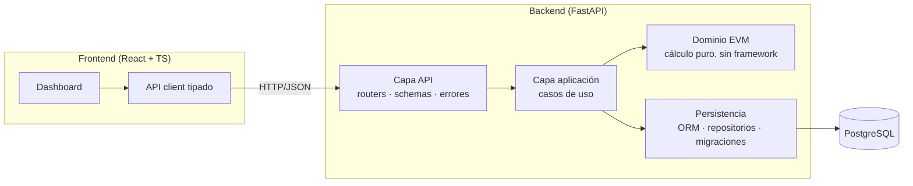
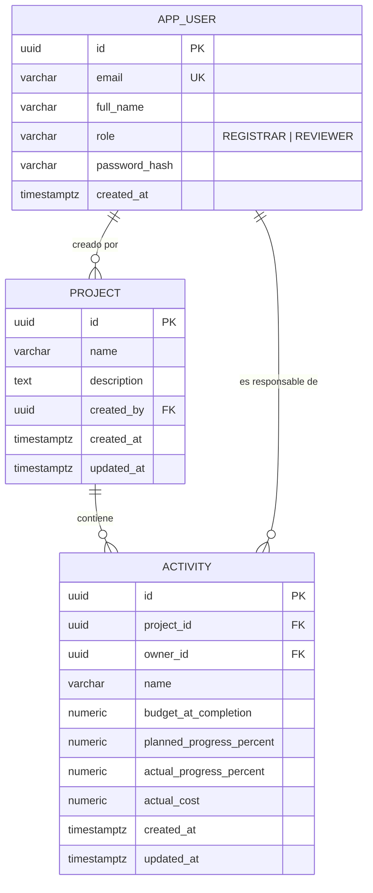
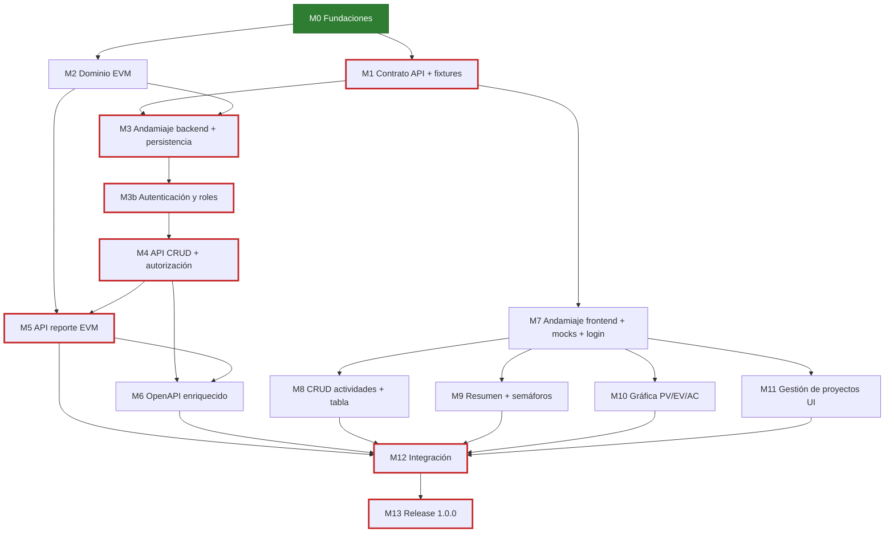

# Arquitectura y descomposición en módulos

Objetivo de este documento: definir la arquitectura de Striker EVM, partirla en módulos con
fronteras claras, hacer explícitas las dependencias entre ellos y derivar de ahí **qué se
puede construir en paralelo y qué no**. El plan está pensado para trabajar varias ramas
`feature/*` a la vez (una por módulo) y minimizar el tiempo total.

---

## 1. Requisitos que condicionan la arquitectura

Del enunciado (`reto.md`) se derivan restricciones no negociables:

| Requisito | Consecuencia arquitectónica |
|---|---|
| Lógica de negocio fuera de los controladores | Capa de **dominio** pura (cálculo EVM) separada de la capa **API** y de la **persistencia**. |
| Cobertura ≥ 80 % en la capa de negocio, casos borde cubiertos | El dominio no depende de framework ni de base de datos: se prueba con tests unitarios puros y rápidos. |
| Un test de integración por endpoint validando el contrato | El **contrato OpenAPI** se define primero y es la referencia de esos tests. |
| Indicadores por actividad **y** consolidados por proyecto | Un servicio de reporte que compone actividades → proyecto. El frontend **no** calcula nada. |
| Dashboard "en tiempo real" | Tras cada creación/edición/borrado, el frontend vuelve a pedir el reporte EVM al backend. |
| Cero code smells, linter en el repo | Linter y formateador configurados en backend y frontend desde el andamiaje. |
| OpenAPI en `/api-docs` o `/swagger-ui` | El framework debe generar OpenAPI desde el código; se enriquece con descripciones y códigos de error. |
| README con instrucciones locales y script de inicialización de BD | `docker compose up` levanta PostgreSQL + backend + frontend; el script SQL de inicialización vive en el repo. |

---

## 2. Stack (decidido el 2026-09-08)

> Decisión del autor: **FastAPI + PostgreSQL + React/Vite**, por velocidad de construcción
> dentro del plazo de cinco días. Registrada en `AI_PROCESS.md` (Prompt 3).

| Capa | Elección | Motivo |
|---|---|---|
| Backend | **Python 3.12 / FastAPI** + SQLAlchemy 2 + Alembic + Pydantic v2 + PyJWT + bcrypt | FastAPI genera OpenAPI automáticamente (se publica en `/api-docs`), `Decimal` nativo para dinero, `pytest` + `pytest-cov` para cobertura, `ruff` como linter/formateador único. JWT para autenticación por roles. |
| Base de datos | **PostgreSQL 16** (Docker) | Preferencia explícita del enunciado. `NUMERIC` para dinero y porcentajes. |
| Frontend | **React 18 + TypeScript + Vite** + Tailwind CSS + **GSAP** + Recharts | Tipado del contrato, arranque rápido. GSAP para transiciones y animaciones de entrada/actualización; Recharts para las gráficas. `ESLint` + `Prettier`. |
| Orquestación local | **Docker Compose** | Un comando para levantar todo; el script SQL de inicialización se monta en el contenedor de PostgreSQL. |

Herramientas disponibles en la máquina de desarrollo: Java 21, Node 24, Python 3.14, Docker
29 con Compose v5. Nota: si se elige FastAPI, usar la imagen `python:3.12` en Docker para
evitar incompatibilidades de librerías con Python 3.14, muy reciente.

---

## 3. Vista general



Regla de dependencias: las flechas solo apuntan hacia adentro. **El dominio no importa
nada** de API ni de persistencia. La capa de aplicación orquesta: lee de repositorios,
llama al dominio, devuelve resultados que la capa API serializa.

---

## 4. Modelo de datos



Restricciones en base de datos (además de la validación en la API):

- `budget_at_completion NUMERIC(14,2) CHECK (> 0)`
- `actual_cost NUMERIC(14,2) CHECK (>= 0)`
- `planned_progress_percent`, `actual_progress_percent NUMERIC(5,2) CHECK (BETWEEN 0 AND 100)`
- `ON DELETE CASCADE` de proyecto a actividades.
- **Los indicadores no se persisten.** Son derivados; se calculan en cada consulta. Evita
  inconsistencias y simplifica la edición.

---

## 5. Contrato del API (v1)

Este contrato es el **punto de sincronización** entre backend y frontend. Se congela antes
de abrir las ramas de ambos lados; cualquier cambio posterior pasa por PR propio.

Prefijo: `/api/v1`. Documentación: `/api-docs` (Swagger UI) y `/api-docs/openapi.json`.

Todos los endpoints salvo `/health` y `/auth/login` requieren `Authorization: Bearer <JWT>`
y responden `401` sin token válido y `403` cuando el rol no tiene permiso (ver §11).

| Método | Ruta | Propósito | Roles | Códigos |
|---|---|---|---|---|
| GET | `/health` | Verificar que el servicio y la BD responden | público | 200 |
| POST | `/auth/login` | Obtener JWT con email y contraseña | público | 200, 400, 401 |
| GET | `/auth/me` | Usuario autenticado y su rol | ambos | 200, 401 |
| GET | `/users` | Listar usuarios (para asignar responsables) | REVIEWER | 200 |
| GET | `/projects` | Listar proyectos (con conteo de actividades) | ambos | 200 |
| POST | `/projects` | Crear proyecto | REVIEWER | 201, 400, 403 |
| GET | `/projects/{projectId}` | Obtener proyecto | ambos | 200, 404 |
| PUT | `/projects/{projectId}` | Editar proyecto | REVIEWER | 200, 400, 403, 404 |
| DELETE | `/projects/{projectId}` | Eliminar proyecto y sus actividades | REVIEWER | 204, 403, 404 |
| GET | `/projects/{projectId}/activities` | Listar actividades (datos crudos) | ambos | 200, 404 |
| POST | `/projects/{projectId}/activities` | Crear actividad | ambos (REGISTRAR queda como responsable) | 201, 400, 404 |
| PUT | `/projects/{projectId}/activities/{activityId}` | Editar actividad | REVIEWER; REGISTRAR solo las propias | 200, 400, 403, 404 |
| DELETE | `/projects/{projectId}/activities/{activityId}` | Eliminar actividad | REVIEWER; REGISTRAR solo las propias | 204, 403, 404 |
| GET | `/projects/{projectId}/evm` | **Reporte EVM**: indicadores por actividad + consolidado + interpretación | ambos | 200, 404 |

Esquemas principales (JSON, `camelCase`; dinero como número con 2 decimales, se fija en el
OpenAPI):

```jsonc
// LoginRequest → LoginResponse
{ "email": "revisor@striker.local", "password": "..." }
{ "accessToken": "eyJ...", "tokenType": "bearer", "user": { "id": "...", "email": "...", "fullName": "...", "role": "REVIEWER" } }

// ActivityInput (POST/PUT)
{
  "name": "Desarrollo",
  "ownerId": "uuid-del-registrador",     // opcional para REGISTRAR (se asigna a sí mismo); obligatorio para REVIEWER
  "budgetAtCompletion": 40000.00,
  "plannedProgressPercent": 50.00,
  "actualProgressPercent": 40.00,
  "actualCost": 20000.00
}

// EvmIndicators (se usa igual para actividad y proyecto)
{
  "budgetAtCompletion": 40000.00,
  "plannedValue": 20000.00,
  "earnedValue": 16000.00,
  "actualCost": 20000.00,
  "costVariance": -4000.00,
  "scheduleVariance": -4000.00,
  "costPerformanceIndex": 0.8000,        // null si no calculable
  "schedulePerformanceIndex": 0.8000,    // null si no calculable
  "estimateAtCompletion": 50000.00,      // null si no calculable
  "varianceAtCompletion": -10000.00,     // null si no calculable
  "costStatus": "OVER_BUDGET",           // UNDER_BUDGET | ON_BUDGET | OVER_BUDGET | NOT_APPLICABLE
  "scheduleStatus": "BEHIND_SCHEDULE",   // AHEAD_OF_SCHEDULE | ON_SCHEDULE | BEHIND_SCHEDULE | NOT_APPLICABLE
  "notes": []                            // motivos cuando algo es NOT_APPLICABLE
}

// EvmReport (GET /projects/{id}/evm)
{
  "project": { "id": "...", "name": "Portal de clientes", "indicators": { /* EvmIndicators */ } },
  "activities": [
    { "id": "...", "name": "Diseño", "input": { /* ActivityInput */ }, "indicators": { /* EvmIndicators */ } }
  ]
}

// Error (todos los 4xx/5xx)
{ "code": "VALIDATION_ERROR", "message": "plannedProgressPercent must be between 0 and 100", "details": [ ... ] }
```

Los valores esperados del reporte para el proyecto de ejemplo están en
[`EVM_GUIA.md`](EVM_GUIA.md#6-ejemplo-completo-con-tres-actividades-resuelto-paso-a-paso);
ese JSON se guarda como *fixture* compartida por backend (tests de integración) y frontend
(mocks).

---

## 6. Módulos

Cada módulo es una rama `feature/<id>` que entra a `develop` por PR. "Entrega" es la
definición de terminado.

| ID | Módulo | Rama | Entrega | Depende de |
|---|---|---|---|---|
| **M0** | Fundaciones del repo | `main` inicial + `feature/docs-evm-guide-and-architecture` | Gitflow, README, guía EVM, este documento, AI_PROCESS.md | — |
| **M1** | Contrato API y fixtures | `feature/api-contract` | `docs/api/openapi.yaml` con todos los endpoints, esquemas, errores; `docs/api/fixtures/*.json` con el proyecto de ejemplo y su reporte esperado | M0 |
| **M2** | Dominio EVM | `feature/backend-evm-domain` | Módulo puro de cálculo: indicadores por actividad, consolidado, interpretación, casos borde. Tests unitarios con los valores de la guía. Cobertura ≥ 80 % (meta: ~100 %). | M0 (solo la guía) |
| **M3** | Andamiaje backend + persistencia | `feature/backend-persistence` | Proyecto FastAPI con `ruff`, `pytest`, `docker-compose` (PostgreSQL), modelos ORM (usuarios, proyectos, actividades), migraciones, `db/init.sql` con usuarios semilla, repositorios, `GET /health` | M1 (nombres de campos), M2 (comparte `pyproject.toml`) |
| **M3b** | Autenticación y roles | `feature/backend-auth-roles` | Login JWT, `GET /auth/me`, `GET /users`, dependencias de FastAPI `current_user` y `require_role`, política de propiedad de actividades; tests unitarios de la política y de integración de `/auth/*` | M3 |
| **M4** | API CRUD proyectos y actividades | `feature/backend-crud-api` | Routers + schemas + validación + manejo de errores uniforme + autorización por rol; test de integración por endpoint contra el contrato (incluye 401/403) | M1, M3, M3b |
| **M5** | API reporte EVM | `feature/backend-evm-report` | Caso de uso `GetProjectEvmReport` que compone M2 + repositorios; endpoint `GET /projects/{id}/evm`; test de integración con la fixture | M2, M4 |
| **M6** | Documentación OpenAPI enriquecida | `feature/backend-openapi-docs` | Descripciones por endpoint, ejemplos, códigos de error, Swagger en `/api-docs`; verificación de que el OpenAPI generado coincide con M1 | M4, M5 |
| **M7** | Andamiaje frontend | `feature/frontend-scaffold` | Vite + React + TS + Tailwind + GSAP, ESLint/Prettier, sistema de diseño (tokens, tema), layout base con transiciones GSAP, cliente API tipado desde `openapi.yaml`, mocks (MSW) con las fixtures de M1, login y sesión (JWT en memoria/`sessionStorage`), rutas protegidas por rol | M1 |
| **M8** | CRUD de actividades + tabla con indicadores | `feature/frontend-activities` | Formulario crear/editar/eliminar actividad (respetando rol y propiedad), tabla animada de actividades con sus indicadores | M7 |
| **M9** | Resumen consolidado y semáforos | `feature/frontend-project-summary` | Tarjetas de indicadores del proyecto con contadores animados, indicación visual de CPI/SPI, manejo de `NOT_APPLICABLE` | M7 |
| **M10** | Gráficas | `feature/frontend-evm-chart` | Barras agrupadas PV/EV/AC por actividad + gauge/velocímetro de CPI y SPI, con animación de entrada y de actualización | M7 |
| **M11** | Gestión de proyectos en UI | `feature/frontend-projects` | Lista/selección/creación de proyecto; vista del REVIEWER (portafolio) y del REGISTRAR (mis actividades) | M7 |
| **M12** | Integración y entrega local | `feature/integration` | `docker compose up` completo (BD + backend + frontend), CORS, variables de entorno, README con pasos de ejecución, usuarios semilla y datos de ejemplo cargados | M5, M6, M8, M9, M10, M11 |
| **M13** | Release | `release/1.0.0` → `main` | Versión, README final, AI_PROCESS.md cerrado, tag `v1.0.0` | M12 |

Transversal (no es rama propia): actualizar `AI_PROCESS.md` en cada PR que involucre
prompts o decisiones, y preparar el guion del video.

---

## 7. Grafo de dependencias



**Ruta crítica** (borde rojo): M1 → M3 → M3b → M4 → M5 → M12 → M13. Es la cadena backend:
no se puede exponer el reporte sin CRUD, ni CRUD autorizado sin roles, ni roles sin
persistencia, ni persistencia sin haber fijado el contrato. Todo lo demás cuelga en paralelo
de esa cadena.

---

## 8. Plan de construcción en paralelo

### Qué se puede paralelizar y por qué

| Se hace en paralelo | Por qué es seguro |
|---|---|
| **M1 ∥ M2** | El dominio EVM solo necesita la guía; no le importa cómo se llaman los campos JSON. El contrato solo necesita la guía y el enunciado. |
| **M3 ∥ M7** | Ambos parten del contrato. Uno construye la BD, el otro la UI contra mocks. No se tocan. |
| **M8 ∥ M9 ∥ M10 ∥ M11** | Componentes independientes que consumen el mismo cliente API mockeado de M7. Se integran en el dashboard al final de la ola. |
| **M4 ∥ (M8–M11)** | El frontend entero avanza contra mocks mientras el backend termina el CRUD. |
| **M6 ∥ frontend** | Enriquecer OpenAPI no bloquea a nadie. |

### Qué **no** se puede paralelizar

| Secuencia obligatoria | Motivo |
|---|---|
| M1 antes de M3, M4, M7 | Si backend y frontend inventan nombres de campos por separado, la integración se vuelve un rehacer. El contrato es la única fuente de verdad compartida. |
| M3 antes de M4 | Los endpoints CRUD escriben y leen de la BD. |
| M2 **y** M4 antes de M5 | El reporte compone cálculo + datos persistidos. |
| Todo antes de M12 | La integración necesita ambos lados reales. |
| M12 antes de M13 | No se libera lo que no corre de punta a punta. |

### Olas de trabajo

```mermaid
gantt
    title Olas de construcción (duración relativa, no fechas)
    dateFormat  X
    axisFormat  %s

    section Ola 0
    M0 Fundaciones                :done, m0, 0, 1

    section Ola 1
    M1 Contrato API + fixtures    :crit, m1, 1, 2
    M2 Dominio EVM + tests        :m2, 1, 3

    section Ola 2 · Backend
    M3 Persistencia               :crit, m3, 2, 4
    M3b Autenticación y roles     :crit, m3b, 4, 5
    M4 API CRUD + autorización    :crit, m4, 5, 6
    M5 API reporte EVM            :crit, m5, 6, 7
    M6 OpenAPI enriquecido        :m6, 7, 8

    section Ola 2 · Frontend
    M7 Andamiaje + mocks          :m7, 2, 3
    M8 CRUD actividades + tabla   :m8, 3, 5
    M9 Resumen + semáforos        :m9, 3, 4
    M10 Gráfica PV/EV/AC          :m10, 3, 4
    M11 Gestión de proyectos      :m11, 4, 5

    section Ola 3
    M12 Integración + README      :crit, m12, 8, 9
    M13 Release 1.0.0             :crit, m13, 9, 10
```



| Ola | Ramas simultáneas | Condición para pasar a la siguiente |
|---|---|---|
| 0 | M0 | Este documento mergeado en `develop`. |
| 1 | **M1, M2** | Contrato congelado y fixtures publicadas; dominio con tests verdes. |
| 2 | **Backend**: M3 → M3b → M4 → M5 → M6 (secuencial) · **Frontend**: M7 → {M8, M9, M10, M11} (paralelo tras M7) | Backend expone `/evm` real con autorización; frontend funciona completo contra mocks. |
| 3 | M12 → M13 | Demo con un proyecto y tres actividades funciona con `docker compose up`. |

### Mecánica para trabajar varias ramas a la vez

- Una rama `feature/*` por módulo, cada una en un **git worktree** propio (directorios
  hermanos), para que varios agentes o sesiones trabajen sin pisarse:
  `git worktree add ../striker-m2 -b feature/backend-evm-domain develop`.
- El contrato (`docs/api/openapi.yaml`) y las fixtures se tratan como **artefactos
  inmutables** durante la ola 2. Un cambio requiere PR propio y aviso a ambos lados.
- Orden de merge en la ola 2: primero lo que otros necesitan (M7 antes que M8–M11); las
  ramas paralelas del frontend se rebasan sobre `develop` antes de abrir PR para evitar
  conflictos en `App.tsx`/rutas.
- Los tests son la puerta de cada PR: dominio (unitarios), API (integración por endpoint),
  frontend (componentes con mocks).

---

## 9. Estructura de directorios objetivo

```
Striker_EVM/
├── backend/
│   ├── app/
│   │   ├── domain/evm/          # M2: cálculo puro (sin FastAPI, sin SQLAlchemy)
│   │   ├── domain/auth/         # M3b: roles y política de permisos (pura)
│   │   ├── application/         # casos de uso: proyectos, actividades, reporte EVM, login
│   │   ├── infrastructure/db/   # M3: modelos ORM, repositorios, sesión, migraciones
│   │   ├── infrastructure/security/ # M3b: JWT, hash de contraseñas
│   │   └── api/v1/              # M4–M6: routers, schemas (Pydantic), errores, dependencias de auth
│   ├── tests/
│   │   ├── unit/domain/         # oráculo: EVM_GUIA.md §5 y §6
│   │   └── integration/api/     # un test por endpoint contra el contrato
│   ├── db/init.sql              # script de inicialización de BD (montado en Postgres)
│   ├── pyproject.toml           # ruff, pytest, cobertura
│   └── Dockerfile
├── frontend/
│   ├── src/
│   │   ├── api/                 # M7: cliente generado desde openapi.yaml
│   │   ├── features/activities/ # M8
│   │   ├── features/summary/    # M9
│   │   ├── features/chart/      # M10
│   │   ├── features/projects/   # M11
│   │   └── mocks/               # MSW con fixtures de docs/api/fixtures
│   ├── .eslintrc.cjs · .prettierrc
│   └── Dockerfile
├── docs/
│   ├── api/openapi.yaml         # M1: contrato
│   ├── api/fixtures/            # M1: proyecto de ejemplo y reporte esperado
│   ├── EVM_GUIA.md · ARQUITECTURA.md · GITFLOW.md · reto.md
├── docker-compose.yml           # M12
├── AI_PROCESS.md
└── README.md
```

---

## 10. Decisiones de diseño registradas

Estas decisiones se tomaron al escribir este documento y quedan abiertas a que el autor las
confirme o cambie (los cambios se anotan en `AI_PROCESS.md`):

1. **Indicadores no persistidos, calculados por consulta.** Simplifica ediciones y evita
   estados inconsistentes. El costo (recalcular en cada GET) es despreciable para el volumen
   de una herramienta interna.
2. **Un único endpoint de reporte** (`GET /projects/{id}/evm`) en lugar de incrustar
   indicadores en cada respuesta de actividad. El frontend obtiene el dashboard completo con
   una llamada y la lógica vive en un solo lugar.
3. **`null` + estado `NOT_APPLICABLE` + `notes`** para indicadores no calculables. Ver
   justificación en `EVM_GUIA.md §5`.
4. **Contrato primero.** Es lo que habilita el paralelismo backend/frontend; su costo es un
   medio día al inicio.
5. **Frontend sin lógica EVM.** Cumple "la lógica de negocio no vive en los controladores"
   llevado al extremo: tampoco vive en la UI. Facilita cumplir la cobertura del 80 % donde
   importa.
6. **Porcentajes en escala 0–100 en la API** (como los ingresa un humano) y fracción 0–1 solo
   dentro del dominio.

---

## 11. Roles y autenticación

Decisión propia del autor (Prompt 3 en `AI_PROCESS.md`): distinguir **quién registra** el
avance de **quién lo revisa**.

### Roles

| Rol | Enum | Quién es | Qué hace |
|---|---|---|---|
| Registrador | `REGISTRAR` | Miembro del equipo responsable de una o varias actividades | Crea actividades (queda como responsable) y actualiza el avance real y el costo real de **sus** actividades. Consulta el reporte del proyecto en el que participa. |
| Revisor | `REVIEWER` | Líder de proyecto / PMO | Crea y administra proyectos, asigna responsables, edita cualquier actividad, revisa el reporte EVM consolidado para conocer el estado del proyecto. |

### Matriz de permisos

| Acción | REGISTRAR | REVIEWER |
|---|---|---|
| Iniciar sesión, ver perfil | ✓ | ✓ |
| Listar y ver proyectos | ✓ | ✓ |
| Crear / editar / eliminar proyecto | ✗ (403) | ✓ |
| Listar usuarios (para asignar responsables) | ✗ (403) | ✓ |
| Crear actividad | ✓, `ownerId` = él mismo | ✓, `ownerId` obligatorio |
| Editar / eliminar actividad propia | ✓ | ✓ |
| Editar / eliminar actividad ajena | ✗ (403) | ✓ |
| Ver reporte EVM del proyecto | ✓ | ✓ |

### Mecanismo

- **Autenticación:** `POST /auth/login` con email y contraseña; respuesta con JWT (HS256,
  expiración 8 h) que lleva `sub` (id de usuario) y `role`. Contraseñas con `bcrypt`.
- **Autorización:** dependencias de FastAPI `get_current_user` (401 si el token falta o es
  inválido) y `require_role(...)` (403). La regla de propiedad de actividades vive en el
  **dominio** (`domain/auth/policy.py`: `can_modify_activity(user, activity)`), probada
  unitariamente sin framework.
- **Usuarios semilla** en `db/init.sql` (la contraseña se documenta en el README, solo para
  entorno local):

| Email | Rol | Nombre |
|---|---|---|
| `revisor@striker.local` | REVIEWER | Laura Revisora |
| `registrador@striker.local` | REGISTRAR | Carlos Registrador |
| `registrador2@striker.local` | REGISTRAR | Ana Registradora |

- **Fuera de alcance** (registrado a propósito): registro de usuarios desde la UI,
  recuperación de contraseña, refresh tokens. Los usuarios se gestionan por el script de
  inicialización.

### Impacto en el frontend

- Pantalla de **login** y sesión en memoria (`sessionStorage` para sobrevivir recargas).
- Rutas protegidas; el layout muestra la vista según rol:
  - **REVIEWER:** portafolio de proyectos → dashboard del proyecto (resumen, semáforos,
    gráficas, tabla completa, asignación de responsables).
  - **REGISTRAR:** "Mis actividades" con edición de avance y costo, más el estado del proyecto
    en modo lectura.
- Los botones de acciones no permitidas no se muestran; además el backend responde 403 si
  se intentan por otra vía.

---

## 12. Lineamientos de diseño del frontend

El autor pidió un frontend "de última generación", con gráficas y animaciones **GSAP** en las
transiciones. Reglas para todas las ramas `feature/frontend-*`:

- **Sistema de diseño único.** Tokens en CSS (colores, radios, sombras, tipografía) con tema
  claro y oscuro. Tipografía con jerarquía clara (números grandes para indicadores). Superficies
  tipo tarjeta con profundidad sutil; nada de plantillas genéricas.
- **Semáforo EVM consistente en toda la app:** verde = bajo presupuesto / adelantado, ámbar =
  en presupuesto / en cronograma, rojo = sobre presupuesto / atrasado, gris = no aplica. Los
  mismos colores en tarjetas, tabla y gráficas.
- **GSAP** se usa para: transición entre vistas (login → dashboard, cambio de proyecto),
  entrada escalonada de tarjetas y filas, contadores numéricos que animan hacia el nuevo valor
  cuando el reporte se recalcula, y cambios de color del semáforo. Toda animación respeta
  `prefers-reduced-motion`. Duraciones cortas (150–500 ms); la UI nunca espera a una animación
  para ser usable.
- **Gráficas (Recharts):** barras agrupadas PV / EV / AC por actividad con tooltip explicativo,
  y gauges de CPI y SPI con la aguja apuntando a 1.0 como referencia. Animación de entrada y de
  actualización.
- **Feedback en tiempo real:** tras cada alta/edición/borrado se vuelve a pedir
  `GET /projects/{id}/evm`; los valores cambian con animación, no con parpadeo.
- **Accesibilidad mínima:** contraste AA, foco visible, etiquetas en formularios, tabla con
  encabezados. Responsive desde 360 px.
- **Estados:** carga (skeletons), vacío (proyecto sin actividades con llamada a la acción),
  error (mensaje claro, reintento).
